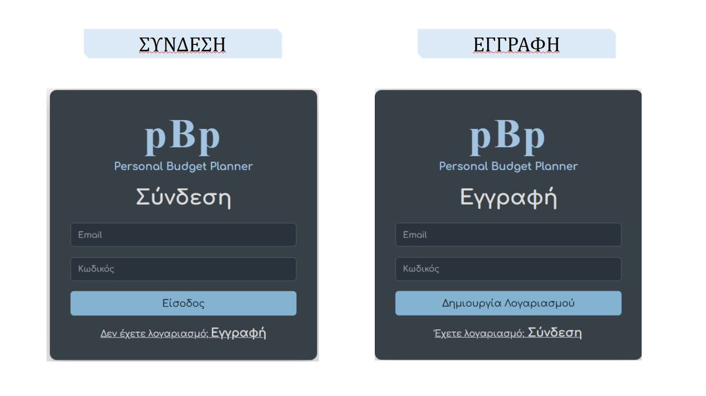
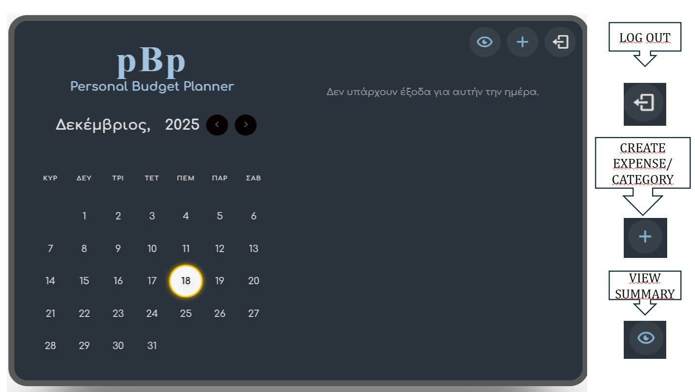
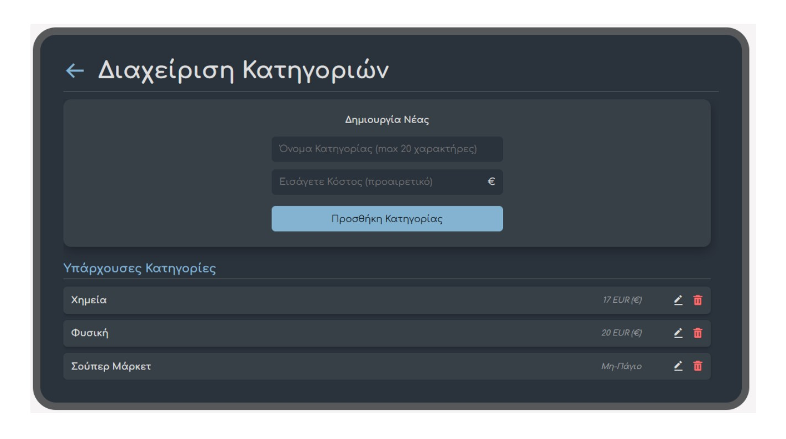
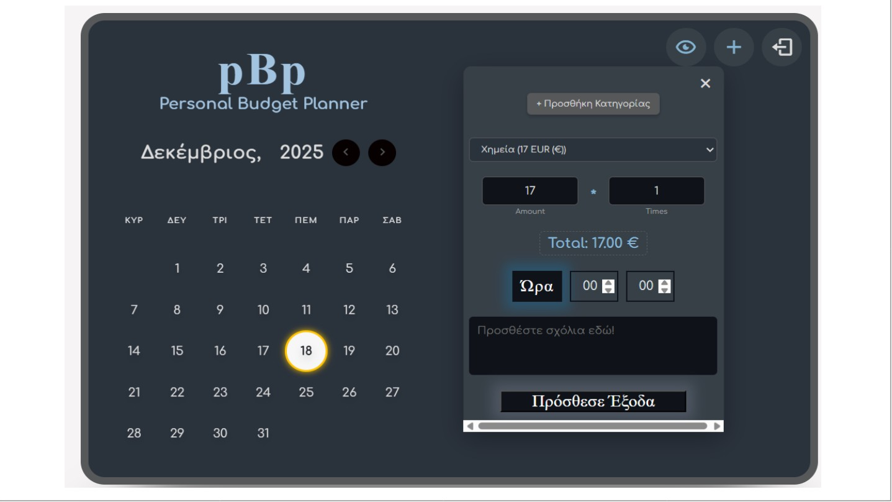
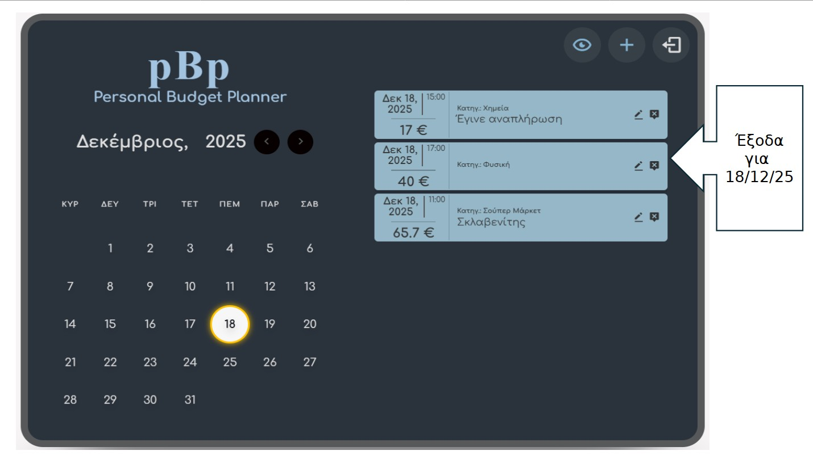

Project name: Personal Budget Planner (pBp)

The Personal Budget Planner (pBp) is a web application designed to help individuals manage and analyze their daily, monthly, and yearly expenses without the complexity of traditional accounting software. It offers a clear, intuitive way to record spending, categorize expenses, and track financial summaries.

This project is a modern web application built with React and bundled using Vite.

To RUN THIS APPLICATION on your local machine, follow these steps. You will need Node.js and npm (Node Package Manager) installed.

1. Clone the Repository
   Open your terminal (e.g., Git Bash) and run the following command to download the code:

   git clone https://github.com/katsamam-hash/personal-budget-planner.git

2. Navigate to the Project Folder
   Change your current directory to the newly cloned project folder:

   cd personal-budget-planner

3. Install Dependencies
   Install all the necessary project libraries and packages (listed in package.json):

   npm install

4. Start the Application
   Start the local development server. This will compile the React code and launch the app in your browser:

   npm run dev

The terminal will usually provide a local address (e.g., http://localhost:5173/). Open this address in your web browser to view the application.
## Application Interface

### Authentication & Navigation
<table border="0">
  <tr>
    <td>
<b>Login & Registration</b>
</td>
    <td>
<b>Main Calendar View</b>
</td>
  </tr>
</table>

### Expense & Category Management
<table border="0">
  <tr>
    <td>
<b>Managing Categories</b>
</td>
    <td>
<b>Adding Expenses</b>
</td>
  </tr>
</table>

### Data Analysis & Reports
<table border="0">
  <tr>
    <td>
<b>Daily Reports</b>
</td>
    <td>
<b>Financial Summaries</b>
</td>
  </tr>
</table>
